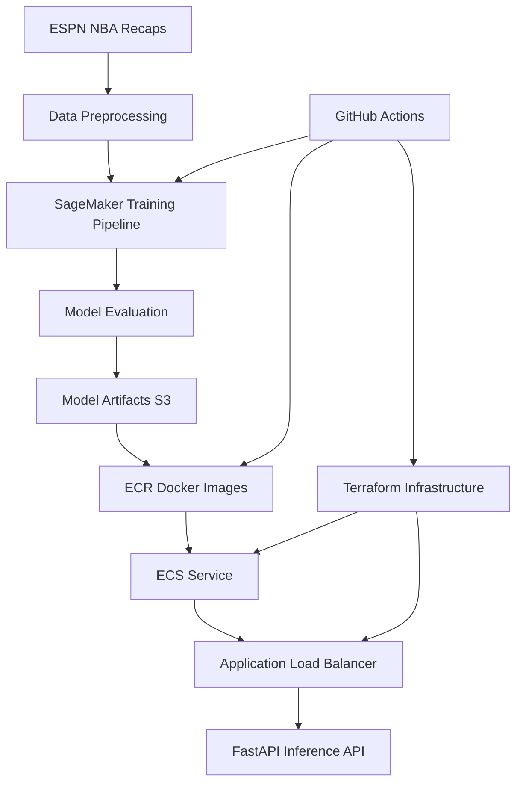

# NBA Game Recap Summarizer

A production-ready machine learning pipeline that fine-tunes LLaMA models to generate concise summaries of NBA game recaps from ESPN. The project includes a complete MLOps infrastructure with AWS SageMaker, Terraform, and containerized deployment.

## 🏀 Overview

This project transforms lengthy NBA game recaps into concise, informative summaries using state-of-the-art language models. It's designed for production use with:

- **Fine-tuned LLaMA 3.2 1B model** with LoRA (Low-Rank Adaptation)
- **4-bit quantization** for memory efficiency
- **Comprehensive evaluation** with ROUGE, BLEU, BERTScore, and LLM-as-a-Judge metrics
- **Production deployment** on AWS ECS with Application Load Balancer
- **CI/CD pipeline** with GitHub Actions
- **Multi-environment support** (dev, staging, prod)

## 🏗️ Architecture



## 🚀 Quick Start

### Prerequisites

- Python 3.10+
- Docker
- AWS CLI configured
- Terraform 1.6.6+

### Local Development

1. **Clone and setup environment:**
```bash
git clone <repository-url>
cd nba-game-recap-summarizer
make create-venv
source .venv/bin/activate
make install
```

2. **Set environment variables:**
```bash
export OPENAI_API_KEY="your-openai-key"
export WANDB_API_KEY="your-wandb-key"
export HF_TOKEN="your-huggingface-token"
```

3. **Run tests:**
```bash
make test
```

4. **Run local pipeline:**
```bash
make run ENV=dev
```

## 📊 Data Pipeline

### Data Source
- **Input**: ESPN NBA game recaps (CSV format)
- **Location**: S3 bucket `nba-recap-summarization-model-source-data`
- **Format**: `game_recaps_with_summaries.csv`

### Preprocessing
- **Text cleaning**: Remove special characters, normalize whitespace
- **Tokenization**: Using LLaMA tokenizer with max length 2048
- **Data splitting**: 50% train, 25% validation, 25% test
- **Format**: Converted to Hugging Face datasets format

### Training Data Structure
```python
{
    "game_recap": "Lakers beat Suns 120-118 in overtime...",
    "summary": "Lakers defeated Suns in overtime thriller...",
    "game_id": "20240115-LAL-PHX"
}
```

## 🤖 Model Architecture

### Base Model
- **Model**: `meta-llama/Llama-3.2-1B-Instruct`
- **Quantization**: 4-bit (bitsandbytes)
- **Memory**: ~2GB GPU memory usage

### Fine-tuning Strategy
- **Method**: LoRA (Low-Rank Adaptation)
- **Parameters**: r=8, alpha=8, dropout=0.1
- **Efficiency**: Only ~1% of parameters trained

### Training Configuration
```yaml
training:
  batch_size: 1
  accumulate_grad_batches: 4
  learning_rate: 1e-5
  max_epochs: 3
  precision: "16-mixed"
  gradient_checkpointing: true
```

## 📈 Evaluation Metrics

### Lexical Metrics
- **ROUGE-1, ROUGE-2, ROUGE-L**: Measures n-gram overlap
- **BLEU**: Precision-based evaluation

### Semantic Metrics
- **BERTScore**: Contextual similarity using BERT embeddings

### LLM-as-a-Judge
- **Relevance**: How well the summary captures key game events
- **Factual Consistency**: Accuracy of information
- **Completeness**: Coverage of important details
- **Clarity**: Readability and coherence
- **Conciseness**: Brevity while maintaining information

## 🏭 Production Infrastructure

### AWS Services
- **SageMaker**: Training and evaluation pipelines
- **ECS**: Container orchestration
- **ECR**: Docker image registry
- **S3**: Data and model storage
- **ALB**: Load balancing
- **VPC**: Network isolation

### Deployment Environments

#### Development (`dev`)
- **Instance**: `ml.g4dn.xlarge`
- **Deployment**: Direct deployment
- **Testing**: Full test suite

#### Staging (`staging`)
- **Instance**: `ml.g4dn.xlarge`
- **Deployment**: Direct deployment
- **Validation**: Production-like testing

#### Production (`prod`)
- **Instance**: `ml.g4dn.xlarge`
- **Deployment**: Canary deployment
- **Monitoring**: Comprehensive logging

### Terraform Infrastructure

```hcl
# Core components
- VPC with public/private subnets
- Application Load Balancer
- ECS Cluster with Fargate
- Auto Scaling Group
- Security Groups
- IAM Roles and Policies
```

## 🔄 CI/CD Pipeline

### GitHub Actions Workflows

#### `dev-train.yaml`
1. **Test**: Run unit and integration tests
2. **Build**: Create training and inference Docker images
3. **Push**: Upload images to ECR
4. **Trigger**: Start SageMaker pipeline
5. **Deploy**: Update ECS service

#### `staging-train.yaml`
- Similar to dev with staging-specific configurations

#### `prod-train.yaml`
- **Canary Deployment**: Gradual rollout strategy
- **Stable Image Check**: Uses existing stable image for primary traffic
- **Rollback**: Automatic rollback on failures

### Pipeline Stages

1. **Preprocessing** (7-10 minutes)
   - Data cleaning and tokenization
   - Train/validation/test splitting

2. **Training** (20-30 minutes)
   - LoRA fine-tuning
   - Checkpoint saving

3. **Evaluation** (5-10 minutes)
   - Comprehensive metrics calculation
   - Performance benchmarking

4. **Deployment** (2-5 minutes)
   - ECS service update
   - Health checks

## 🐳 Containerization

### Training Image (`Dockerfile.training`)
```dockerfile
FROM pytorch/pytorch:2.0.1-cuda11.8-cudnn8-runtime
# SageMaker-compatible training environment
# Includes: PyTorch, Transformers, PEFT, bitsandbytes
```

### Inference Image (`Dockerfile.inference`)
```dockerfile
FROM 763104351884.dkr.ecr.us-east-1.amazonaws.com/pytorch-inference:2.0.1-gpu-py310-cu118-ubuntu20.04-sagemaker
# FastAPI inference service
# Optimized for production serving
```

## 📊 Monitoring & Logging

### Logging
- **Structured Logging**: JSON format with loguru
- **Log Levels**: DEBUG, INFO, WARNING, ERROR
- **CloudWatch**: Centralized log aggregation

### Metrics
- **Training Metrics**: Loss, learning rate, GPU utilization
- **Inference Metrics**: Latency, throughput, error rates
- **Business Metrics**: Request volume, user satisfaction

### Health Checks
- **Model Loading**: Verify model is loaded and ready
- **API Health**: Endpoint availability
- **Resource Health**: CPU, memory, GPU usage

## 🧪 Testing Strategy

### Test Types
- **Unit Tests**: Individual component testing
- **Integration Tests**: Pipeline component interaction
- **End-to-End Tests**: Full workflow validation
- **Load Tests**: Performance under stress

### Test Commands
```bash
# All tests
make test

# Training-specific tests
make test-training

# Inference-specific tests
make test-inference

# With coverage
make test ENV=dev
```

## 🔧 Configuration Management

### Environment Configs
- **`config.dev.yaml`**: Development settings
- **`config.staging.yaml`**: Staging settings  
- **`config.prod.yaml`**: Production settings
- **`config.test.yaml`**: Test settings

### Key Configuration Options
```yaml
model:
  name: "meta-llama/Llama-3.2-1B-Instruct"
  quantization: true
  max_length: 2048

training:
  batch_size: 1
  learning_rate: 1e-5
  max_epochs: 3

evaluation:
  test_samples_lexical_metrics: 5
  test_samples_semantic_metrics: 5
  test_samples_ai_as_judge_metrics: 2
```

## 🚀 Deployment Commands

### Local Development
```bash
# Setup environment
make create-venv && source .venv/bin/activate
make install

# Run tests
make test

# Run full pipeline
make run ENV=dev
```

### SageMaker Pipeline
```bash
# Trigger training pipeline
make sagemaker-pipeline-trigger \
  ENV=dev \
  ECR_REPOSITORY_URI=your-ecr-uri \
  IMAGE_TAG=dev-latest \
  SAGEMAKER_ROLE_ARN=your-role-arn
```

### Infrastructure
```bash
# Deploy infrastructure
cd terraform/envs/dev
terraform init
terraform apply

# Destroy infrastructure
cd terraform/envs/dev
terraform destroy
```

## 📚 API Documentation

### Endpoints

#### `GET /api`
Returns API information and available endpoints.

#### `POST /summarize_recap`
Generates a summary from an NBA game recap.

**Request:**
```json
{
  "game_recap": "Lakers beat Suns 120-118 in overtime...",
  "max_length": 2048
}
```

**Response:**
```json
{
  "game_recap_summary": "Lakers defeated Suns in overtime thriller..."
}
```

#### `GET /health`
Health check endpoint for monitoring.

### Interactive Documentation
- **Swagger UI**: `http://your-domain/`
- **ReDoc**: `http://your-domain/redoc`

## 🔒 Security

### Authentication
- **API Keys**: OpenAI, Weights & Biases, Hugging Face
- **AWS IAM**: Role-based access control
- **Container Security**: Non-root user, minimal base images

### Network Security
- **VPC**: Isolated network environment
- **Security Groups**: Restrictive firewall rules
- **HTTPS**: TLS encryption for all communications

## 📈 Performance Optimization

### Memory Optimization
- **4-bit Quantization**: Reduces memory usage by ~75%
- **Gradient Checkpointing**: Trades compute for memory
- **Mixed Precision**: 16-bit training for efficiency

### Inference Optimization
- **Batch Processing**: Multiple requests per batch
- **Model Caching**: Keep model in memory
- **Connection Pooling**: Reuse HTTP connections

## 🐛 Troubleshooting

### Common Issues

#### CUDA Out of Memory
```bash
# Reduce batch size in config
batch_size: 1
accumulate_grad_batches: 4
```

#### Model Loading Errors
```bash
# Check model path and permissions
aws s3 ls s3://your-bucket/model-path/
```

#### API Timeout
```bash
# Check ECS service health
aws ecs describe-services --cluster your-cluster --services your-service
```

### Debug Commands
```bash
# Check logs
docker logs container-name

# Monitor resources
htop
nvidia-smi

# Test API
curl -X POST http://localhost:8000/summarize_recap \
  -H "Content-Type: application/json" \
  -d '{"game_recap": "Test recap"}'
```

## 🤝 Contributing

### Development Workflow
1. Fork the repository
2. Create a feature branch
3. Make changes with tests
4. Run `make check` to validate
5. Submit a pull request

### Code Standards
- **Formatting**: Black + Ruff
- **Type Hints**: MyPy compliance
- **Testing**: Pytest with coverage
- **Documentation**: Docstrings and comments

## 📄 License

This project is licensed under the MIT License - see the LICENSE file for details.

## 🙏 Acknowledgments

- **Meta AI**: For the LLaMA 3.2 model
- **Hugging Face**: For the Transformers library
- **AWS**: For SageMaker and infrastructure services
- **PyTorch Lightning**: For training framework
- **FastAPI**: For the inference API

## 📞 Support

For questions or issues:
- **Issues**: GitHub Issues
- **Discussions**: GitHub Discussions
- **Documentation**: This README and inline docs

---

**Built with ❤️ for NBA fans and ML practitioners**