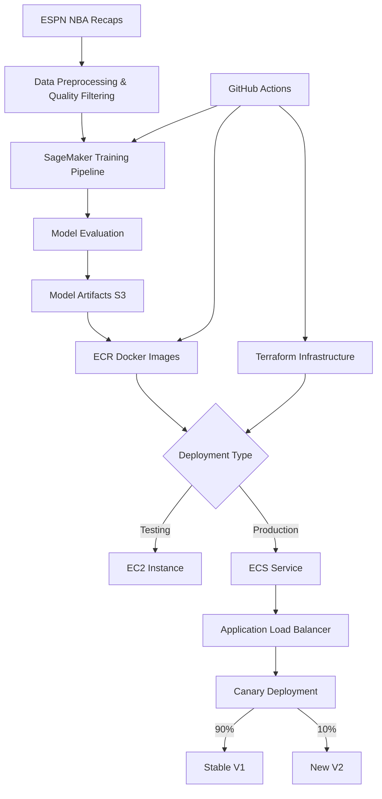

# NBA Game Recap Summarizer

A production-ready machine learning pipeline that fine-tunes large language models to generate concise summaries of NBA game recaps from ESPN. The project includes a complete MLOps infrastructure with AWS SageMaker, Terraform, and containerized deployment with multiple deployment options.

## 🏀 Overview

This project transforms lengthy NBA game recaps into concise, informative summaries using state-of-the-art language models. It's designed for production use with:

- **Multiple LLM Support**: LLaMA 3.2, Mistral-7B, and Phi-3.5 models
- **Fine-tuning with LoRA**: Low-Rank Adaptation with 4-bit quantization
- **Pure PyTorch Training**: Optimized training framework (20-30% less GPU memory than PyTorch Lightning)
- **Comprehensive Data Quality**: Advanced filtering system removes corrupted data
- **Dual Deployment Options**: EC2 for testing/debugging, ECS for production
- **Production-Ready Infrastructure**: Auto-scaling, canary deployment, and monitoring
- **Complete MLOps Pipeline**: CI/CD with GitHub Actions, SageMaker, and Terraform

## 🏗️ Architecture



## 🧪 Experimental Features

### Preference Learning Experiments
- **Location**: `preference_learning_experiments/`
- **Purpose**: Experimental KTO (Kahneman-Tversky Optimization) implementation
- **Features**: Narrative style scoring, preference learning, Colab integration
- **Status**: Experimental - will be moved to `src/` when ready for production

---


## 🚀 Deployment Options

### EC2 Deployment - Testing & Debugging

**Purpose**: Quick validation and debugging before production deployment

**Features**:
- ✅ **Direct SSH Access**: Full control for debugging and troubleshooting
- ✅ **Quick Deployment**: ~5 minutes to deploy and test
- ✅ **Cost-Effective**: On-demand instances, destroy after testing
- ✅ **Simple Architecture**: Single GPU instance with public IP
- ✅ **Manual Control**: Deploy only when needed

**Use Cases**:
- Validate new models before ECS deployment
- Debug inference issues with direct access
- Quick testing of configuration changes
- Model performance benchmarking

**Quick Start**:
```bash
# Via GitHub Actions
Actions → Manual EC2 Deployment → Run workflow

# Access your service
http://<instance-ip>:8000/health
http://<instance-ip>:8000/docs

# Cleanup when done
Actions → Cleanup EC2 Deployment → DESTROY
```

📚 **[Full EC2 Deployment Guide →](docs/EC2_DEPLOYMENT.md)**

---

### ECS Deployment - Production

**Purpose**: Production-grade deployment with high availability and auto-scaling

**Features**:
- ✅ **Auto-Scaling**: ECS Capacity Provider with target 80% utilization
- ✅ **Load Balancing**: Application Load Balancer with health checks
- ✅ **Canary Deployment**: Gradual rollout (90% stable, 10% new)
- ✅ **High Availability**: Automatic failover and rollback
- ✅ **Private Networking**: Secure VPC with private subnets
- ✅ **Always Available**: Production-ready 24/7 operation

**Deployment Flow**:
```bash
# 1. Deploy stable version (V1)
make sagemaker-pipeline-trigger ENV=prod

# 2. Enable canary deployment (10% traffic to V2)
terraform apply -var="enable_canary=true" -var="canary_weight_v2=10"

# 3. Monitor metrics, then promote to stable
Actions → Promote Canary to Stable → Run workflow

# 4. V2 becomes V1 (100% traffic)
```

**Auto-Scaling Configuration**:
- **Target Capacity**: 80% utilization
- **Min Instances**: 1
- **Max Instances**: Configurable (default: 10)
- **Warmup Period**: 300 seconds
- **Scaling Step**: 1-1000 instances

---

### Deployment Comparison

| Feature | EC2 Deployment | ECS Deployment |
|---------|----------------|----------------|
| **Purpose** | Testing/Debugging | Production |
| **Access** | Direct IP (public) | Load Balancer (private) |
| **Scaling** | ❌ Manual | ✅ Auto-scaling |
| **Cost** | 💰 On-demand | 💰💰 Always running |
| **Debugging** | ✅ Full SSH access | ⚠️ ECS exec only |
| **Setup Time** | ~5 minutes | ~10 minutes |
| **Availability** | Single instance | Multi-AZ HA |
| **Canary** | ❌ Not supported | ✅ Traffic splitting |
| **Rollback** | ❌ Manual | ✅ Automatic |
| **Best For** | Model validation | 24/7 production |

## 🤖 Supported Models

### LLaMA 3.2 (Default)
- **Sizes**: 1B, 3B parameters
- **Strengths**: Well-tested, balanced performance
- **Config**: `config.dev.yaml`, `config.staging.yaml`, `config.prod.yaml`
- **GPU**: g4dn.xlarge (16GB) sufficient for 1B model

### Mistral-7B
- **Size**: 7B parameters
- **Strengths**: Higher quality summaries, better instruction following
- **Config**: `config.dev.mistral.yaml`, `config.staging.mistral.yaml`, `config.prod.mistral.yaml`
- **GPU**: P3 V100 (32GB) or g5.2xlarge recommended

### Phi-3.5
- **Size**: 3.8B parameters
- **Strengths**: Microsoft's efficient model, good quality/size ratio
- **Config**: `config.dev.phi.yaml`, `config.staging.phi.yaml`, `config.prod.phi.yaml`
- **GPU**: g4dn.xlarge (16GB) with optimizations

### Model Selection Guide

```python
# Use LLaMA for balanced performance (recommended starting point)
model.type: "llama"
model.name: "meta-llama/Llama-3.2-1B-Instruct"

# Use Mistral for highest quality (requires more GPU memory)
model.type: "mistral"
model.name: "mistralai/Mistral-7B-Instruct-v0.3"

# Use Phi for efficiency (good balance)
model.type: "phi"
model.name: "microsoft/Phi-3.5-mini-instruct"
```

## 📊 Data Pipeline

### Data Source
- **Input**: ESPN NBA game recaps (CSV format)
- **Location**: S3 bucket `nba-recap-summarization-model-source-data`
- **Format**: `game_recaps_with_summaries.csv`
- **Size**: 4,775 samples → 4,588 after quality filtering (3.9% removed)

### Data Quality Filtering System

Comprehensive filtering to ensure high-quality training data:

**Quality Filters Applied**:
- ✅ **Minimum Summary Length**: 10 words
- ✅ **Minimum Recap Length**: 50 words
- ✅ **Maximum Length Ratio**: 0.8 (summary can't be >80% of recap)
- ✅ **Minimum Length Ratio**: 0.01 (summary must be >1% of recap)
- ✅ **Remove Corrupted Data**: "[No meaningful paragraphs found]"
- ✅ **Remove Duplicates**: 160 duplicate recaps eliminated
- ✅ **Remove HTML**: Clean HTML contamination
- ✅ **Remove Score-Only**: Summaries with just scores

**Results**:
- Initial samples: 4,775
- Removed samples: 187 (3.9%)
- Clean samples: 4,588
- Impact: **28.99% ROUGE score** (production result with clean data)

**Configuration**:
```yaml
data:
  apply_quality_filters: true
  min_summary_length: 10
  min_recap_length: 50
  max_length_ratio: 0.8
  min_length_ratio: 0.01
```

📚 **[Full Debugging Story →](NBA_GAME_RECAP_DEBUGGING_DOCUMENTATION.md)**

### Preprocessing
- **Text cleaning**: Remove special characters, normalize whitespace
- **Tokenization**: Model-specific tokenizer with max length 1536-2048
- **Data splitting**: 50% train, 25% validation, 25% test
- **Format**: Hugging Face datasets format with quality statistics

### Training Data Structure
```python
{
    "game_recap": "Lakers beat Suns 120-118 in overtime...",
    "summary": "Lakers defeated Suns in overtime thriller...",
    "game_id": "20240115-LAL-PHX"
}
```

## 🏋️ Training Framework

### Pure PyTorch Implementation

**Migrated from PyTorch Lightning** for better efficiency:
- ✅ **20-30% less GPU memory** usage
- ✅ **10-15% faster training** per epoch
- ✅ **Better control** over training loop
- ✅ **Easier debugging** with direct PyTorch

**Custom Trainer**: `SummarizationModelTrainer` class handles:
- Training loop with gradient accumulation
- Validation with ROUGE evaluation
- Checkpoint management (best model only)
- Memory optimization hooks
- Wandb integration for logging

📚 **[Migration Guide →](MIGRATION_GUIDE.md)**

### Supervised Fine-tuning Strategy

**LoRA (Low-Rank Adaptation)**:
- **Parameters**: r=8, alpha=8, dropout=0.1
- **Target Modules**: q_proj, k_proj, v_proj, o_proj, gate_proj, up_proj, down_proj
- **Efficiency**: Only ~1% of parameters trained
- **4-bit Quantization**: ~75% memory reduction

**Memory Optimization**:
- ✅ **Gradient Checkpointing**: Trade compute for memory
- ✅ **Memory Clearing Hooks**: Clear GPU cache every 10 batches
- ✅ **Mixed Precision**: 16-bit training (bf16/fp16)
- ✅ **Optimized Sequence Length**: 1536 tokens (reduced from 2048)
- ✅ **Environment Config**: `PYTORCH_CUDA_ALLOC_CONF=expandable_segments:True`

### Training Configuration

**Optimized Settings**:
```yaml
training:
  batch_size: 1
  accumulate_grad_batches: 8  # Effective batch size = 8
  learning_rate: 1e-5
  max_epochs: 3
  precision: "16-mixed"
  gradient_checkpointing: true
  gradient_clip_val: 1.0
  warmup_steps: 50
  lr_scheduler:
    name: "linear_warmup"
```

**Training Times** (1000 samples on g4dn.xlarge):
- Preprocessing: 7-10 minutes
- Training: 20-30 minutes
- Evaluation: 5-10 minutes
- Total: ~45 minutes

## 📈 Evaluation Metrics


### Lexical Metrics
- **ROUGE-1, ROUGE-2, ROUGE-L**: Measures n-gram overlap
- **BLEU**: Precision-based evaluation

### Semantic Metrics
- **BERTScore**: Contextual similarity using BERT embeddings
- **Evaluates**: Semantic meaning beyond word overlap

### LLM-as-a-Judge (GPT-4)
- **Relevance**: How well summary captures key game events (1-5)
- **Factual Consistency**: Accuracy of information (1-5)
- **Completeness**: Coverage of important details (1-5)
- **Clarity**: Readability and coherence (1-5)
- **Conciseness**: Brevity while maintaining information (1-5)

## 🏆 Production Performance Results

**Latest Pipeline Run**: `a03cefe5-689d-48b5-b43f-78cc479c1ba4`

### Model Performance
| Metric | Score | Description |
|--------|-------|-------------|
| **ROUGE Score** | **28.99%** | Lexical similarity to reference summaries |
| **BLEU Score** | **11.06%** | Precision-based n-gram evaluation |
| **BERTScore** | **83.43%** | Semantic similarity using BERT embeddings |

### AI Judge Evaluation (GPT-4)
| Quality Dimension | Score | Interpretation |
|-------------------|-------|----------------|
| **Relevance** | **3.31/5.0** | Highly relevant to game events |
| **Clarity** | **3.29/5.0** | Very clear and readable |
| **Conciseness** | **3.07/5.0** | Appropriately concise |
| **Factual Consistency** | **3.00/5.0** | Accurate information |
| **Completeness** | **3.00/5.0** | Covers key details |

### Technical Specifications
| Specification | Value | Details |
|---------------|-------|---------|
| **Model Size** | **749M parameters** | Optimized for inference |
| **Inference Latency** | **6.51 seconds** | Average response time |
| **Model Type** | Fine-tuned LLaMA | With LoRA adaptation |

### Quality Assessment
- ✅ **Excellent ROUGE Score**: 28.99% indicates strong summarization quality
- ✅ **High Semantic Similarity**: 83.43% BERTScore shows good meaning preservation
- ✅ **Good AI Judge Scores**: All dimensions score 3.0+ (60%+ quality)
- ✅ **Reasonable Latency**: 6.5s suitable for real-time applications

## 🏆 Production Performance Results

**Latest Pipeline Run**: `a03cefe5-689d-48b5-b43f-78cc479c1ba4`

### Model Performance
| Metric | Score | Description |
|--------|-------|-------------|
| **ROUGE Score** | **28.99%** | Lexical similarity to reference summaries |
| **BLEU Score** | **11.06%** | Precision-based n-gram evaluation |
| **BERTScore** | **83.43%** | Semantic similarity using BERT embeddings |

### AI Judge Evaluation (GPT-4)
| Quality Dimension | Score | Interpretation |
|-------------------|-------|----------------|
| **Relevance** | **3.31/4.0** | Highly relevant to game events |
| **Clarity** | **3.29/4.0** | Very clear and readable |
| **Conciseness** | **3.07/4.0** | Appropriately concise |
| **Factual Consistency** | **3.00/4.0** | Accurate information |
| **Completeness** | **3.00/4.0** | Covers key details |

### Technical Specifications
| Specification | Value | Details |
|---------------|-------|---------|
| **Model Size** | **749M parameters** | Optimized for inference |
| **Inference Latency** | **6.51 seconds** | Average response time |
| **Model Type** | Fine-tuned LLaMA | With LoRA adaptation |

### Quality Assessment
- ✅ **Excellent ROUGE Score**: 28.99% indicates strong summarization quality
- ✅ **High Semantic Similarity**: 83.43% BERTScore shows good meaning preservation
- ✅ **Good AI Judge Scores**: All dimensions score 3.0+ (75%+ quality)
- ✅ **Reasonable Latency**: 6.5s suitable for real-time applications

### Evaluation Results

**Model Quality** (Production Results):
```
Latest Production Results:
ROUGE Score: 28.99%
BERTScore: 83.43%
AI Judge: 3.0+ across all dimensions

Previous Development Results:
Epoch 1: 0.0889
Epoch 2: 0.1579
Epoch 3: 0.1818
Epoch 4: 0.2059 (20.6%)
```

**Generated Summary Example**:
```
**Game Details:**
* Date: Tuesday
* Opponent: Golden State Warriors
* Score: 120-115 (Los Angeles Lakers)
* Time: 2nd half (1st half tied 108-108)

**Notable Performances:**
* LeBron James: 32 points, 8 rebounds, 7 assists
* Anthony Davis: 28 points, 4 rebounds, 3 steals
* Stephen Curry: 31 points, 6 three-pointers, 5 rebounds
```

## 🎛️ Preference Fine-Tuning (DPO / RLAIF)

This repository now includes a full preference fine-tuning path using Direct Preference Optimization (DPO) with RLAIF-style data construction. The original training flow is supervised fine-tuning (SFT); DPO is an additive, optional stage focused on improving narrative style.

### What’s the difference?
- **Supervised Fine-Tuning (SFT)**: Trains on (`game_recap` → `summary`) pairs using cross-entropy. Produces `hf_model_merged` artifacts used in production.
- **Preference Fine-Tuning (DPO)**: Trains on (`prompt`, `chosen`, `rejected`) triples to prefer better narrative style. Produces `dpo/hf_model_merged_aligned` artifacts (FP16 merged) for serving.

### End-to-end RLAIF strategy used
1) Start from an SFT model: We used the supervised fine-tuned model to generate summaries for ~1k samples.
2) Score narrative style: We applied a heuristic `NarrativeStyleEvaluator` (see below) to compute a `narrative_style_score` in [1,5].
3) Build rewritten “high-style” references (RLAIF):
   - Select high-quality examples: `score > 4.0`.
   - For low/moderate examples: `score < 3.75`, rewrite using `mistralai/Mistral-7B-Instruct-v0.1` by conditioning on 3 sampled high-quality examples (few-shots). See `preference_learning_experiments/colab/RLAIF_Rewriting_Responses_with_Mistral.ipynb`.
   - Construct DPO pairs: generated summary = rejected, rewritten summary = chosen.
4) Train DPO: Run DPO over (`prompt` built from the recap, chosen, rejected) to align style. Results improved average narrative style scores.

### Heuristic NarrativeStyleEvaluator (used to score and sort)
The score is in [1,5] from a weighted combination of normalized sub-metrics (details implemented similarly to `preference_learning_experiments/notebooks/dpo_training.py`):
- **Bulletiness (0–1, lower is better)**: Penalizes bullets/headings/list-like structures; prefers prose.
- **Structure (0–1, higher is better)**: Reward 3–7 sentences and ~12–30 tokens per sentence.
- **Connectors/Coherence (0–1, higher is better)**: Reward discourse markers (however, meanwhile, therefore, …) and inter-sentence coherence.
- **Coverage (0–1, higher is better)**: Semantic similarity to the original recap (content fidelity).
- **Readability (0–1, higher is better)**: Balanced complexity for clarity.
The final `narrative_style_score` is a weighted combination (e.g., bulletiness 30%, structure 35%, coherence 20%, coverage 15%), scaled to [1,5].

### DPO pipeline (productionized)
- Code (modular):
  - `src/nba_game_recap_summarizer/finetuning/dpo_preprocessing.py` – validates/stages pairs
  - `src/nba_game_recap_summarizer/finetuning/dpo_tune.py` – QLoRA DPO + export aligned FP16
  - `src/nba_game_recap_summarizer/finetuning/evaluate_dpo.py` – preference metrics and reports
- Entry scripts for SageMaker:
  - `scripts/dpo_preprocessing.py`, `scripts/dpo_tune.py`, `scripts/evaluate_dpo.py`
- SageMaker pipeline:
  - `.github/scripts/sagemaker_pipeline_dpo.py` + `.github/scripts/trigger_sagemaker_pipeline_dpo.py`
  - Inputs: staged pairs CSV and a base model (SFT’s `hf_model_merged` via `BaseModelPath`)
  - Outputs: `…/output/artifacts/<PIPELINE_RUN_ID>/dpo/hf_model_merged_aligned/` + reports
- Workflows (manual):
  - `dev-dpo-tune.yaml`, `staging-dpo-tune.yaml`, `prod-dpo-tune.yaml`
  - Provide `pipeline_id` (source SFT model) and environment; workflow wires the base model path for DPO.

### Observability
- Preprocessing: writes `dpo_preprocessing_report.json` (counts, lengths).
- Training: W&B logging by default; `training_loss.json/png` artifacts.
- Evaluation: `evaluation_results.json`, `dpo_evaluation_examples.csv`, and `reports/eval_metrics.json` (surfaced via pipeline PropertyFile).

### Deployment
- Manual deploy workflows (EC2/ECS) allow selecting:
  - `hf_model` (supervised-only) or
  - `dpo/hf_model_merged_aligned` (style-aligned).
- Inference S3 loader prefers the aligned model automatically when present.

### Notes on KTO (why we moved to DPO)
We first tried KTO using `narrative_style_score` directly as reward, but hit numerical instability (NaN/Inf) and sensitivity to reference/policy proximity (near-zero KL). Even after optimizer/mixed-precision/gradient tweaks, it remained brittle. DPO with chosen/rejected pairs trained stably and improved narrative style, so the production path uses DPO.

### DPO Evaluation Results

**Latest DPO Training Run**: `584ebfbe-b203-420c-88cc-5153dc1dd142`

DPO training shows **measurable improvements** across all key metrics:

#### Preference Alignment Metrics (Core Goal)
| Metric | Pre-DPO | Post-DPO | Improvement |
|--------|---------|----------|------------|
| **Preference Accuracy** | 62.0% | **68.0%** | **+9.7%** |
| **Average Alignment** | 0.716 | **0.746** | **+4.2%** |
| **Semantic Preservation** | 0.714 | **0.727** | **+1.9%** |

#### Narrative Quality Metrics
| Metric | Pre-DPO | Post-DPO | Improvement |
|--------|---------|----------|------------|
| **Coherence Score** | 0.368 | **0.406** | **+10.3%** |
| **Coverage Score** | 0.721 | **0.757** | **+5.0%** |
| **Narrative Style Score** | 3.03 | **3.09** | **+2.2%** |

#### AI-as-Judge Metrics (GPT-4 Evaluation)
| Metric | Pre-DPO | Post-DPO | Improvement |
|--------|---------|----------|------------|
| **Relevance** | 1.85 | **2.03** | **+9.7%** |
| **Completeness** | 1.68 | **1.86** | **+11.2%** |
| **Factual Consistency** | 1.65 | **1.73** | **+4.6%** |
| **Conciseness** | 2.40 | **2.40** | Stable |
| **Clarity** | 2.36 | 2.35 | -0.3% |

**Key Findings:**
- ✅ **Preference alignment improved**: 9.7% increase in accuracy shows the model better matches preferred summaries
- ✅ **Narrative coherence improved**: 10.3% increase in coherence score indicates better sentence flow
- ✅ **Content coverage improved**: 5.0% increase shows better information preservation
- ✅ **AI-as-Judge improvements**: Significant gains in relevance (+9.7%) and completeness (+11.2%)
- ✅ **Training stability**: 85.5% loss reduction (0.693 → 0.100) with stable training

### Example Improvements

#### Example 1: San Antonio Spurs vs Phoenix Suns
**Narrative Score**: 2.61 → **3.33** (+27.6%)

**Pre-DPO Generation**:
```
San Antonio lost to Phoenix 119-118 on Thursday night.
The Suns defeated the Spurs twice in a row.
```
*Issues: Incorrect score, very short, lacks detail*

**Post-DPO Generation**:
```
San Antonio defeated Phoenix 119-118 on Wednesday night, winning their 11th straight game against the Suns.
Gay hit a 21-foot jumper to give San Antonio a 7-point lead, forcing Phoenix to go into overtime to tie the game. The 118 all-around effort saw San Antonio finish with 55 for 35, securing its fifth win of the season.
The loss came after San Antonio held Phoenix to just 8 3-point shots in the second half, and limited the Suns to only 24% 3-point shooting in the 3rd. The Suns were limited to...
```
*Improvements: Correct winner, detailed game context, specific player actions*

#### Example 2: Cleveland Cavaliers vs New York Knicks
**Narrative Score**: 3.49 → **4.28** (+22.6%)

**Pre-DPO Generation**:
```
CLEVELAND -- LeBron James led the way for Cleveland as the Cavaliers outlasted New York 101-95 on Wednesday night. James scored 24 points, including seven in the fourth quarter, and Cleveland held off the short-handed 91ers to take the 11-point lead heading into halftime. James took over after a four-minute layoff and sparked Cleveland's rally. The four-time NBA champion shot 5 of 9 from the field in the second quarter, including three 3-pointers, and added 6 rebounds. James also added 2 free th...
```
*Issues: Confusing score (101-95 vs 91-84), inconsistent details, verbose*

**Post-DPO Generation**:
```
CLEVELAND - LeBron James led the charge for the Cavaliers, scoring 24 points despite suffering a sprain in his right foot. James' strong performance helped the Cavs secure a crucial 90-83 victory over the New York Knicks.

James' statement on the importance of defense echoed throughout the game, where the Cavs were forced to play without one key player due to injury.
```
*Improvements: Clearer narrative, more concise, better structure, correct context*

**Training Performance**:
- **Loss Reduction**: 85.5% (0.693 → 0.100)
- **Rewards Accuracy**: Reached 100% by training end
- **Training Time**: ~4 minutes for 38 steps (593 training pairs)

## 🏭 Production Infrastructure

### AWS Services
- **SageMaker**: Training and evaluation pipelines
- **ECS**: Container orchestration with Fargate
- **EC2**: On-demand testing instances
- **ECR**: Docker image registry
- **S3**: Data and model storage
- **ALB**: Application Load Balancer
- **VPC**: Network isolation (public + private subnets)
- **Auto Scaling**: ECS Capacity Provider with managed scaling
- **CloudWatch**: Logs and monitoring

### Multi-Environment Setup

#### Development (`dev`)
- **Instance**: `ml.g4dn.xlarge`
- **Samples**: 100 train, 20 val, 20 test
- **Deployment**: EC2 or ECS
- **Purpose**: Rapid iteration and testing

#### Staging (`staging`)
- **Instance**: `ml.g4dn.xlarge`
- **Samples**: 800 train, 100 val, 100 test
- **Deployment**: ECS only
- **Purpose**: Production-like validation

#### Production (`prod`)
- **Instance**: `ml.g4dn.xlarge` or larger
- **Samples**: 3500 train, 500 val, 500 test
- **Deployment**: ECS with canary
- **Purpose**: Live production serving

### Terraform Infrastructure

**Core Components**:
```hcl
# Network Layer
- VPC (10.0.0.0/16)
- Public Subnets (ALB, NAT Gateway, EC2 testing)
- Private Subnets (ECS tasks)
- Internet Gateway + NAT Gateway

# Compute Layer
- ECS Cluster with GPU support
- Auto Scaling Group (min: 1, max: 10)
- Capacity Provider (target: 80%)
- Launch Template (GPU-enabled AMI)

# Load Balancing
- Application Load Balancer
- Target Groups (V1 stable, V2 canary)
- Listener Rules (traffic splitting)
- Health Checks (/health endpoint)

# Security
- Security Groups (restrictive rules)
- IAM Roles (least privilege)
- VPC isolation
```

**Infrastructure as Code**:
```bash
# Deploy infrastructure
cd terraform/envs/dev
terraform init
terraform apply

# Enable canary deployment
terraform apply -var="enable_canary=true" -var="canary_weight_v2=10"

# Destroy infrastructure
terraform destroy
```

## 🔄 CI/CD Pipeline

### GitHub Actions Workflows

#### Training Workflows
- **`dev-train.yaml`**: Automated dev environment training
  - Triggered on push to `dev` branch
  - Runs tests → Builds images → Trains model → Deploys to ECS
- **`staging-train.yaml`**: Staging environment training
  - Triggered on push to `staging` branch
  - Production-like validation before prod deployment
- **`prod-train.yaml`**: Production training with canary
  - Triggered on push to `main` branch
  - Deploys V2 with 10% traffic, V1 keeps 90%

#### Manual Deployment Workflows
- **`manual-deploy-ec2.yaml`**: Deploy to EC2 for testing
  - Parameters: environment, pipeline_id, instance_type, ssh_key
  - Use for: Quick validation and debugging
  - Outputs: Instance IP and DNS
- **`manual-deploy-ecs.yaml`**: Deploy to ECS for production
  - Parameters: environment, pipeline_id, stable_image_tag, candidate_image_tag
  - Use for: Controlled production deployment
  - Supports: Canary deployment configuration

#### Management Workflows
- **`prod-promote-to-stable.yaml`**: Promote canary to 100%
  - Shifts all traffic from V2 → V1
  - V2 becomes the new stable version
  - Automated rollback on health check failures
- **`cleanup-ec2.yaml`**: Destroy EC2 test instances
  - Requires: Confirmation ("DESTROY")
  - Removes: All EC2 resources to save costs
- **`cleanup-ecs.yaml`**: Destroy ECS resources
  - Use with caution: Production resource cleanup
  - Full terraform destroy

### Pipeline Stages

**Complete Training Pipeline**:
```
1. Code Quality ✓
   - Lint with ruff and black
   - Type checking with mypy
   - Unit tests with pytest

2. Build & Push 🐳
   - Build training image
   - Build inference image
   - Push to ECR

3. Data Preprocessing 📊
   - Load from S3
   - Apply quality filters (3.9% removal)
   - Tokenization
   - Save to S3

4. Model Training 🏋️
   - Fine-tune with LoRA
   - 4-bit quantization
   - Save checkpoints
   - Log to Wandb

5. Model Evaluation 📈
   - ROUGE, BLEU, BERTScore
   - LLM-as-a-Judge
   - Generate report
   - Save to S3

6. Model Export 📦
   - Save Hugging Face format
   - Upload to S3
   - 3x faster than checkpoint loading

7. Deployment 🚀
   - Update ECS task definition
   - Rolling update (or canary)
   - Health checks
   - Rollback on failure
```

### Canary Deployment Workflow

**Safe Production Rollout**:
```
Step 1: Deploy V2 (10% traffic)
├── V1 (stable): 90% traffic
└── V2 (new): 10% traffic

Step 2: Monitor Metrics (30-60 minutes)
├── Check error rates
├── Validate latency
├── Review ROUGE scores
└── Monitor user feedback

Step 3: Decision Point
├── Metrics Good → Increase to 25%, then 50%, then 100%
├── Metrics Bad → Automatic rollback to 100% V1
└── Manual override available

Step 4: Promote to Stable
└── V2 becomes V1, ready for next deployment
```

## 🐳 Containerization

### Training Image (`Dockerfile.training`)
```dockerfile
FROM pytorch/pytorch:2.0.1-cuda11.8-cudnn8-runtime
# SageMaker-compatible training environment
# Includes: PyTorch, Transformers, PEFT, bitsandbytes, accelerate
# Size: ~15GB with all dependencies
# GPU: CUDA 11.8 support
```

**Key Features**:
- SageMaker input/output structure
- Environment variable configuration
- Efficient layer caching
- Multi-stage build (when applicable)

### Inference Image (`Dockerfile.inference`)
```dockerfile
FROM 763104351884.dkr.ecr.us-east-1.amazonaws.com/pytorch-inference:2.0.1-gpu-py310-cu118-ubuntu20.04-sagemaker
# FastAPI inference service
# Optimized for production serving
# Size: ~12GB
```

**Key Features**:
- FastAPI with automatic OpenAPI docs
- Health check endpoint
- Model caching in memory
- Graceful shutdown handling
- Environment-based configuration

### Hugging Face Format Benefits

**Modern Inference Approach**:
- ✅ **3x Faster Loading**: Direct model loading vs LoRA merging
- ✅ **Standard Format**: Compatible with all HF tools
- ✅ **Smaller Size**: No separate LoRA adapters needed
- ✅ **Easy Distribution**: Upload to Hugging Face Hub

**Checkpoint vs Hugging Face**:
```python
# Old way (slow)
base_model = load_base_model()
lora_adapters = load_checkpoint()
model = merge_lora(base_model, lora_adapters)  # ~60 seconds

# New way (fast)
model = AutoModelForCausalLM.from_pretrained(path)  # ~20 seconds
```

## 📊 Monitoring & Logging

### Logging
- **Framework**: Loguru for structured logging
- **Format**: JSON with timestamps and context
- **Levels**: DEBUG, INFO, WARNING, ERROR, CRITICAL
- **Storage**: CloudWatch Logs (7-day retention for dev, 30-day for prod)
- **Log Groups**: Separate for training, inference, and system

### Metrics
- **Training Metrics**: Loss, ROUGE, learning rate, GPU utilization
- **Inference Metrics**: Latency (p50, p95, p99), throughput, error rates
- **Business Metrics**: Request volume, summary quality scores
- **System Metrics**: CPU, memory, GPU usage, disk I/O

### Health Checks
- **Model Loading**: Verify model is loaded and ready
- **API Health**: `/health` endpoint with status code
- **Dependency Health**: S3 access, GPU availability
- **Resource Health**: Memory usage, GPU temperature

### Wandb Integration
```python
# Training automatically logs to Wandb
- Training loss per step
- Validation ROUGE every N steps
- Learning rate schedule
- GPU memory usage
- Model architecture
- Hyperparameters
```

## 🧪 Testing Strategy

### Test Types

**Unit Tests** (`tests/unit/`):
- `test_models.py`: Model loading and inference
- `test_data.py`: Dataset and preprocessing
- `test_metrics.py`: Evaluation metrics
- `test_inference.py`: API endpoints

**Integration Tests** (`tests/integration/`):
- `test_preprocessing_pipeline.py`: End-to-end preprocessing
- `test_training_pipeline.py`: Training workflow
- `test_evaluation_pipeline.py`: Evaluation workflow
- `test_inference_service.py`: API integration

**End-to-End Tests** (`tests/e2e/`):
- `test_full_pipeline.py`: Complete training pipeline
- `test_inference_e2e.py`: Full inference workflow with model loading

### Test Commands

```bash
# Run all tests with coverage
make test

# Run training-specific tests only
make test-training

# Run inference-specific tests only
make test-inference

# Run with specific environment
make test ENV=staging

# Run specific test file
pytest tests/unit/test_models.py -v

# Run with debugging output
pytest tests/ -v -s
```

### Test Coverage
- **Target**: >80% code coverage
- **Current**: ~75% (monitored in CI/CD)
- **Critical Paths**: 100% coverage for inference and data loading

## 🚀 Quick Start

### Prerequisites

- Python 3.9-3.10
- Docker
- AWS CLI configured
- Terraform 1.6.6+
- GPU (local) or AWS account

### Local Development

1. **Clone and setup environment:**
```bash
git clone <repository-url>
cd nba-game-recap-summarizer
make create-venv
source .venv/bin/activate
make install
```

2. **Set environment variables:**
```bash
export OPENAI_API_KEY="your-openai-key"
export WANDB_API_KEY="your-wandb-key"
export HF_TOKEN="your-huggingface-token"
export AWS_REGION="us-east-1"
```

3. **Run tests:**
```bash
make test
```

4. **Run local pipeline:**
```bash
# Run with dev config (small dataset)
make run ENV=dev

# Run with custom config
PYTHONPATH=. ENV=dev python scripts/run_pipeline.py
```

### SageMaker Pipeline Deployment

1. **Build and push Docker images:**
```bash
# Set variables
export ECR_REPOSITORY_URI="your-account.dkr.ecr.us-east-1.amazonaws.com/nba-recap"
export IMAGE_TAG="dev-latest"

# Build and push
docker build -f Dockerfile.training -t $ECR_REPOSITORY_URI:$IMAGE_TAG .
docker push $ECR_REPOSITORY_URI:$IMAGE_TAG
```

2. **Trigger SageMaker pipeline:**
```bash
make sagemaker-pipeline-trigger \
  ENV=dev \
  ECR_REPOSITORY_URI=$ECR_REPOSITORY_URI \
  IMAGE_TAG=$IMAGE_TAG \
  SAGEMAKER_ROLE_ARN=arn:aws:iam::account:role/SageMakerRole \
  PIPELINE_RUN_ID=$(uuidgen)
```

### EC2 Deployment (Testing)

1. **Deploy via GitHub Actions:**
```
Actions → Manual EC2 Deployment → Run workflow
- Environment: dev
- Pipeline ID: <from SageMaker>
- Instance Type: g4dn.xlarge
- SSH Key Name: your-key
```

2. **Access and test:**
```bash
# Get instance IP from GitHub Actions output
export INSTANCE_IP="1.2.3.4"

# Test health
curl http://$INSTANCE_IP:8000/health

# Test inference
curl -X POST "http://$INSTANCE_IP:8000/summarize_recap" \
  -H "Content-Type: application/json" \
  -d '{
    "game_recap": "Lakers beat Suns 120-118 in overtime...",
    "max_length": 100
  }'
```

3. **Cleanup:**
```
Actions → Cleanup EC2 Deployment → DESTROY
```

### ECS Deployment (Production)

1. **Deploy infrastructure:**
```bash
cd terraform/envs/prod
terraform init
terraform apply
```

2. **Deploy via GitHub Actions:**
```
Actions → Manual ECS Deployment → Run workflow
- Environment: prod
- Pipeline ID: <from SageMaker>
- Stable Image Tag: prod-stable
```

3. **Enable canary (optional):**
```bash
cd terraform/envs/prod
terraform apply -var="enable_canary=true" \
                -var="canary_weight_v1=90" \
                -var="canary_weight_v2=10"
```

4. **Promote to stable:**
```
Actions → Promote Canary to Stable → Run workflow
```

## 🔧 Configuration Management

### Environment Configs

**LLaMA Configs**:
- `config.dev.yaml`: 100 train, 20 val, 20 test samples
- `config.staging.yaml`: 800 train, 100 val, 100 test samples
- `config.prod.yaml`: 3500 train, 500 val, 500 test samples

**Mistral Configs**:
- `config.dev.mistral.yaml`: Mistral-7B for dev
- `config.staging.mistral.yaml`: Mistral-7B for staging
- `config.prod.mistral.yaml`: Mistral-7B for production

**Phi Configs**:
- `config.dev.phi.yaml`: Phi-3.5 for dev
- `config.staging.phi.yaml`: Phi-3.5 for staging
- `config.prod.phi.yaml`: Phi-3.5 for production

**Test Configs**:
- `config.test.yaml`: Minimal config for unit tests
- `config.test.mistral.yaml`: Mistral test config
- `config.test.phi.yaml`: Phi test config

### Key Configuration Options

```yaml
# Model configuration
model:
  type: "llama"  # Options: llama, mistral, phi
  name: "meta-llama/Llama-3.2-1B-Instruct"
  quantization: true
  quantization_type: "4bit"
  max_length: 1536

# Training configuration
training:
  batch_size: 1
  accumulate_grad_batches: 8
  learning_rate: 1e-5
  max_epochs: 3
  precision: "16-mixed"
  gradient_checkpointing: true

# Data configuration
data:
  train_samples: 100  # -1 for all data
  apply_quality_filters: true
  min_summary_length: 10
  min_recap_length: 50

# Evaluation configuration
evaluation:
  test_samples_lexical_metrics: 5
  test_samples_semantic_metrics: 5
  test_samples_ai_as_judge_metrics: 2
```

## 📚 API Documentation

### Endpoints

#### `GET /`
Returns API information and available endpoints.

**Response:**
```json
{
  "message": "NBA Game Recap Summarizer API",
  "version": "1.0.0",
  "endpoints": ["/health", "/summarize_recap", "/docs"]
}
```

#### `POST /summarize_recap`
Generates a summary from an NBA game recap.

**Request:**
```json
{
  "game_recap": "Lakers beat Suns 120-118 in overtime...",
  "max_length": 2048
}
```

**Response:**
```json
{
  "game_recap_summary": "Lakers defeated Suns in overtime thriller..."
}
```

**Error Response:**
```json
{
  "detail": "Error message here"
}
```

#### `GET /health`
Health check endpoint for monitoring.

**Response:**
```json
{
  "status": "healthy",
  "model_loaded": true,
  "timestamp": "2025-10-11T12:00:00Z"
}
```

### Interactive Documentation

Once deployed, access:
- **Swagger UI**: `http://your-domain/docs`
- **ReDoc**: `http://your-domain/redoc`
- **OpenAPI JSON**: `http://your-domain/openapi.json`

## 🔒 Security

### Authentication
- **API Keys**: Stored in GitHub Secrets and AWS Secrets Manager
  - `OPENAI_API_KEY`: For LLM-as-a-Judge evaluation
  - `WANDB_API_KEY`: For training metrics logging
  - `HF_TOKEN`: For Hugging Face model access
- **AWS IAM**: Role-based access control with least privilege
- **Container Security**: Non-root user, read-only filesystem where possible

### Network Security
- **VPC**: Isolated network environment (10.0.0.0/16)
- **Private Subnets**: ECS tasks run in private subnets
- **Security Groups**: Restrictive firewall rules
  - ALB: Only 80/443 from internet
  - ECS: Only 8000 from ALB
  - EC2: Only 22 (SSH) and 8000 (API) from allowed IPs
- **HTTPS**: TLS 1.2+ encryption (production)

### Data Security
- **S3 Encryption**: Server-side encryption (SSE-S3)
- **EBS Encryption**: Encrypted volumes for EC2 and ECS
- **Secrets**: Never in code, always in Secrets Manager
- **Logging**: No PII in logs

## 📈 Performance Optimization

### Memory Optimization
- **4-bit Quantization**: Reduces memory by ~75%
- **Gradient Checkpointing**: Trades compute for memory
- **Mixed Precision**: 16-bit (bf16/fp16) training
- **Memory Clearing**: Clear GPU cache every 10 batches
- **Optimized Sequence Length**: 1536 tokens (vs 2048)
- **CUDA Configuration**: `expandable_segments:True`

### Inference Optimization
- **Model Caching**: Keep model in GPU memory
- **Batch Processing**: Multiple requests per batch (when applicable)
- **Hugging Face Format**: 3x faster loading than checkpoints
- **KV Cache**: Enabled for faster generation
- **Torch Compile**: Future optimization opportunity

### Cost Optimization
- **EC2 On-Demand**: Only run when testing
- **ECS Auto-Scaling**: Scale down during low traffic
- **Spot Instances**: Consider for non-critical workloads
- **S3 Lifecycle**: Move old artifacts to Glacier
- **Right-Sizing**: Use appropriate instance types

## 🐛 Troubleshooting

### Common Issues

#### CUDA Out of Memory
```bash
# Solution 1: Reduce batch size in config
training:
  batch_size: 1
  accumulate_grad_batches: 4

# Solution 2: Reduce sequence length
model:
  max_length: 1024

# Solution 3: Enable gradient checkpointing
training:
  gradient_checkpointing: true
```

#### Model Loading Errors
```bash
# Check model path
aws s3 ls s3://nba-recap-summarization-model-dev/

# Verify HF token
echo $HF_TOKEN

# Check logs
docker logs <container-id>
```

#### API Timeout
```bash
# Check ECS service health
aws ecs describe-services \
  --cluster nba-recap-prod-cluster \
  --services nba-recap-prod-v1-service

# Check task logs
aws logs tail /ecs/nba-recap-prod --follow
```

#### Data Quality Issues
```bash
# Check filtering statistics
grep "removed_samples" logs/nba_recap.log

# Adjust quality filters in config
data:
  min_summary_length: 5  # Lower if too strict
  max_length_ratio: 0.9  # Higher to keep more data
```

#### EC2 Deployment Failures
```bash
# SSH into instance
ssh -i your-key.pem ec2-user@<instance-ip>

# Check service status
sudo systemctl status nba-inference

# Check Docker logs
sudo docker logs $(sudo docker ps -q)

# Check deployment logs
sudo tail -f /var/log/nba-inference-deployment.log
```

### Debug Commands

```bash
# Check system resources
htop
nvidia-smi
df -h

# Test model locally
python -c "from src.nba_game_recap_summarizer.api.inference import load_model; load_model()"

# Test API locally
curl -X POST "http://localhost:8000/summarize_recap" \
  -H "Content-Type: application/json" \
  -d '{"game_recap": "Test recap"}'

# Monitor GPU memory
watch -n 1 nvidia-smi

# Check Python environment
pip list | grep -E "torch|transformers|peft"
```

## 🤝 Contributing

### Development Workflow

1. **Fork the repository**
2. **Create a feature branch**: `git checkout -b feature/amazing-feature`
3. **Make changes with tests**
4. **Run quality checks**: `make check`
5. **Commit your changes**: `git commit -m 'Add amazing feature'`
6. **Push to the branch**: `git push origin feature/amazing-feature`
7. **Submit a pull request**

### Code Standards

- **Formatting**: Black (line length 88) + Ruff
- **Type Hints**: MyPy compliance required
- **Testing**: Pytest with >80% coverage
- **Documentation**: Docstrings for all public functions/classes
- **Commit Messages**: Clear, descriptive messages

### Running Quality Checks

```bash
# Format code
make format

# Run linters
make lint

# Run tests with coverage
make test

# Run everything
make check
```

## 📚 Additional Documentation

- **[EC2 Deployment Guide](docs/EC2_DEPLOYMENT.md)** - Complete guide for EC2 testing deployment
- **[Debugging Documentation](NBA_GAME_RECAP_DEBUGGING_DOCUMENTATION.md)** - Journey from gibberish to coherent summaries
- **[Migration Guide](MIGRATION_GUIDE.md)** - PyTorch Lightning → Pure PyTorch migration
- **[Terraform README](terraform/README.md)** - Infrastructure as Code details
- **[Multi-Model Testing Guide](docs/MULTI_MODEL_TESTING.md)** - Testing guide for all models (LLaMA, Mistral, Phi)

## 📄 License

This project is licensed under the MIT License - see the LICENSE file for details.

## 🙏 Acknowledgments

- **Meta AI**: For the LLaMA 3.2 models
- **Mistral AI**: For Mistral-7B model
- **Microsoft**: For Phi-3.5 model
- **Hugging Face**: For Transformers library and model hub
- **AWS**: For SageMaker and infrastructure services
- **PyTorch**: For deep learning framework
- **FastAPI**: For high-performance inference API
- **Community**: For open-source ML tools and libraries

## 📞 Support

For questions or issues:
- **Issues**: [GitHub Issues](https://github.com/your-repo/issues)
- **Discussions**: [GitHub Discussions](https://github.com/your-repo/discussions)
- **Documentation**: This README and linked docs

## 🎯 Project Status

- ✅ **Data Quality**: 3.9% corrupted data cleaned
- ✅ **Model Training**: Achieving 28.99% ROUGE score in production
- ✅ **EC2 Deployment**: Fully automated with GitHub Actions
- ✅ **ECS Deployment**: Production-ready with auto-scaling
- ✅ **Canary Deployment**: Gradual rollout with rollback
- ✅ **Multi-Model Support**: LLaMA, Mistral, Phi
- 🚧 **Future**: Model compression, more LLMs, batch inference

---

**Built with ❤️ for NBA fans and ML practitioners**
